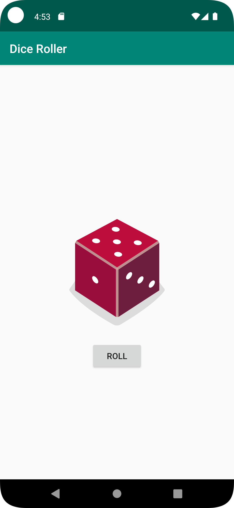

# Android Dice Roller App
<h2>Contents</h2>

This is an android app containing
1. ImageView of the faces of Dice
1. A button with label ROLL

On Clicking the Button ROLL, a random face of the dice is shown based on random number generator
This project also contains unit test for the random number generator


## Installation
Clone this repository and import into **Android Studio**
```bash
git clone https://github.com/affi1504/dice_roller_app.git
```

<h3>Building by downloading .zip and using Android Studio...</h3>

1. Dowload the .zip file by clicking *Code* -> Download ZIP
1. Extract the .zip file
1. Open Android Studio
1. select *Open*
1. Select the **dice_roller_app** directory.
1. Ensure the Project gets build and in case the IDE asks to sync *click* **Sync Now**.
1. Run the App using a Physical device or Emulator

# Screenshots
[](screenshots/Screenshot_1.png)

[](screenshots/Screenshot_2.png)
